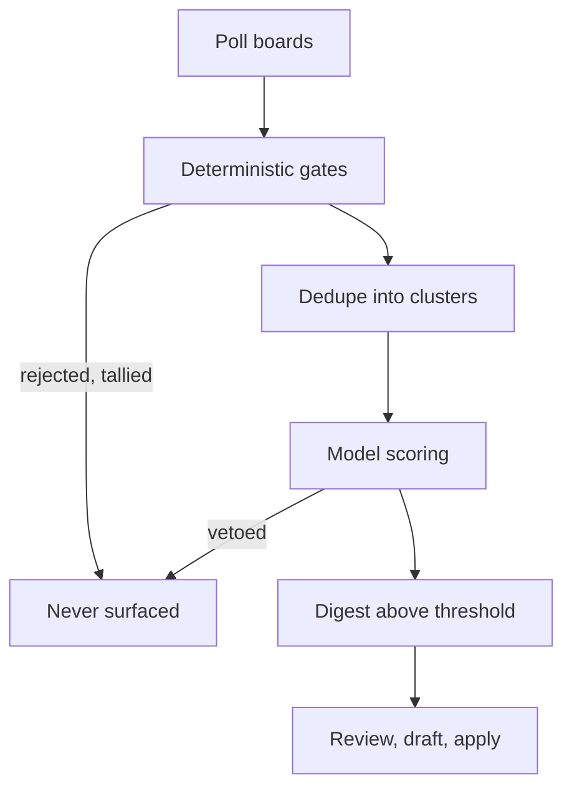

# How winnow decides

Winnow rejects roughly 99% of what it sees. Three design decisions produce that
number, and understanding them explains most of the tool's behaviour — including
the parts that look unhelpful at first.

## How it works

A posting passes through four stages. Each is cheaper than the next, and each
discards work the next would have paid for.

### Cheap rules run before the model

Compensation floors, remote requirements, employment type and title relevance
are all decidable from structured data. None needs a language model, so none
gets one.

A single poll of 22 boards sees about 2,900 postings. Around 40 reach a model.
Scoring all 2,900 would cost more than the job search, so the pipeline is
arranged to make that unnecessary rather than affordable.

Gate order matters. Location is settled before postings are collapsed into
clusters, because one role advertised in nine countries is nine postings and
only one of them is relevant.

### Missing evidence never satisfies a gate

Every gating field is three-valued: stated yes, stated no, or unknown. A
posting that does not mention its location is `UNKNOWN`, not "probably remote".

Gates fire in one direction only. A stated onsite requirement rejects. Silence
about location does not pass the remote gate — it leaves the posting to be
judged on what it does say.

The failure this prevents is specific. A gate that treats missing data as
passing admits exactly the postings it exists to exclude, because the postings
that hide a return-to-office requirement are the ones that do not mention it.

Every inferred value carries where it came from, and the scorer does not trust
those equally:

| Provenance | Example | May satisfy a gate |
|---|---|---|
| `structured` | Ashby's `isRemote` boolean | Yes |
| `location_string` | "Remote — US" in a location field | Yes |
| `description_text` | The word "remote" in prose | Flags only |
| `absent` | Nothing said | No |

Compensation is the sharpest case. Aggregators publish modelled salaries, and a
predicted $205,000 must never satisfy a $200,000 floor. `predicted` may flag;
only `stated` and `parsed` may gate.

### Silence is reported, never implied

Every component that can return nothing distinguishes "there is nothing" from
"I could not see". From outside they look identical and they mean opposite
things.

- A board that fails is named in the digest. The digest never reports a quiet
  day it cannot vouch for.
- A scraped careers page that stops parsing raises. A scraper returning zero on
  a redesigned page is indistinguishable from a company that stopped hiring.
- An application that goes unanswered for 21 days is recorded as
  `no_response` rather than left out of the statistics. Leaving it out would
  divide interviews only by the applications somebody answered — the one
  population guaranteed to flatter every score.

## Key terms

| Term | Definition |
|---|---|
| Gate | A deterministic rejection rule. Runs before scoring, needs no model, and records why it fired. |
| Veto | A model judgement that overrides a score rather than reducing it. A posting scoring 88 with a detected onsite requirement is rejected, not ranked 88th. |
| Cluster | One real job, across every posting and board that advertises it. |
| Provenance | Where a field's value came from, carried alongside the value. |
| Rubric | `profile.yaml`. Every weight, floor and gate the pipeline applies. |

## Limits and considerations

**It only sees boards you name.** There is no crawler. Automated board
discovery was measured at roughly 50% accuracy and produced confidently wrong
answers — a search for one company's board returned a similarly-named
company's. Pasting a URL is more reliable than any search.

**Scores are not comparable across rubric versions.** Every score records the
rubric that produced it, so a calibration report can say which one it covers. A
hand edit that forgets to bump `version` still changes the hash.

**Rejection counts are kept, rejected postings are not.** Storing every
rejected posting would be thousands of rows a week, nearly all engineering jobs
that were never candidates. The per-run tally answers "how many roles died on
the comp floor this month" without the storage.

**The model is asked to quote.** A dimension scored above zero without a
quotable span from the posting, or quoting text the posting does not contain,
is dropped and recorded as unverified.

## Related tasks

- [Quickstart](../quickstart.md)
- [Rubric reference](../reference/rubric.md) — the file every rule here reads
- [Add a company board](../how-to/add-a-board.md)
